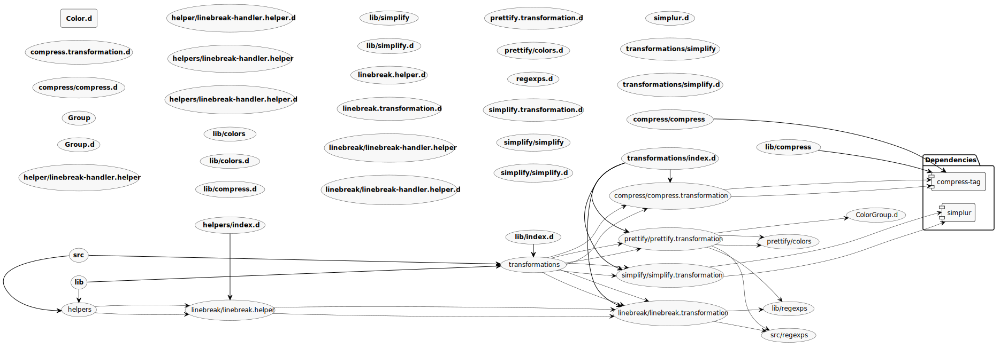

`ztrings` is a small opiniated string template package built to enable convenience and flexibility for you string-based needs, features:

- Strings color styling in node and in the browser (using ASCII code escapes)
- String pluralization using [simplur](https://github.com/broofa/BroofaJS/tree/master/simplur)
- Prettify strings in source code using [compress-tag](https://github.com/iansan5653/compress-tag)

## Getting started

`ztrings` is hosted on npm, so you can install it with:

```
npm install ztrings --save
yarn add ztrings --save
```

## Dependencies

- [simplur](https://github.com/broofa/BroofaJS/tree/master/simplur)
- [compress-tag](https://github.com/iansan5653/compress-tag)

## Examples

For usage of each package functionaly head to their corresponding `Examples` section
- [simplur](https://github.com/broofa/BroofaJS/tree/master/simplur#usage)
- [compress-tag](https://github.com/iansan5653/compress-tag#examples)


```javascript
import { z } from 'ztrings';

console.log(z`
    I have ${21} color[|s]\N

    {bright bright}\N
    {dim dim}
    {underscore underscore}\N
    {blink blink}
    {reverse reverse}\N
    {red red}
    {green green}\N
    {yellow yellow}
    {blue blue}\N
    {magenta magenta}
    {cyan cyan}\N
    {white white}
    {bgBlack bgBlack}\N
    {bgRed bgRed}
    {bgGreen bgGreen}\N
    {bgYellow bgYellow}
    {bgBlue bgBlue}\N
    {bgMagenta bgMagenta}
    {bgCyan bgCyan}\N
    {bgWhite bgWhite}
    {bgRed dim Test}\N
`);
```
<image src="./demo.gif"/>


## Contributing

If you have a particular use case, shoot your issue/PR and I'll do my best to help and improve `zstrings` for all of us to enjoy :)
Also you can take a look at the [roadmap](#Roadmap) below of some of the bullet points I consider would be a great enhancement for the package

## Roadmap

- [x] Compress in one package many strings utility functions
- [x] Custom coloring `prettify` functionality
- [x] Find a way to escape line breaks at will (achieved using custom escape character `\N`)
- [ ] Add support for tabs `\t`
- [ ] Escape line breaks using the conventional `\n` (not sure if possible)
- [ ] Make the `z` function configurable, pass as flags the transformation functions
- [ ] Allow for custom transformation functions
- [ ] Add unit tests to make more maintainable the project
- [ ] Build a website that showcases the functionality of `zstrings`
- [ ] Write documentation regarding how performant the `z` function is
- [ ] Make sure xss is not possible using this package
- [ ] Write `CONTRIBUTING.md` file to make contributors welcome

## Folder structure


